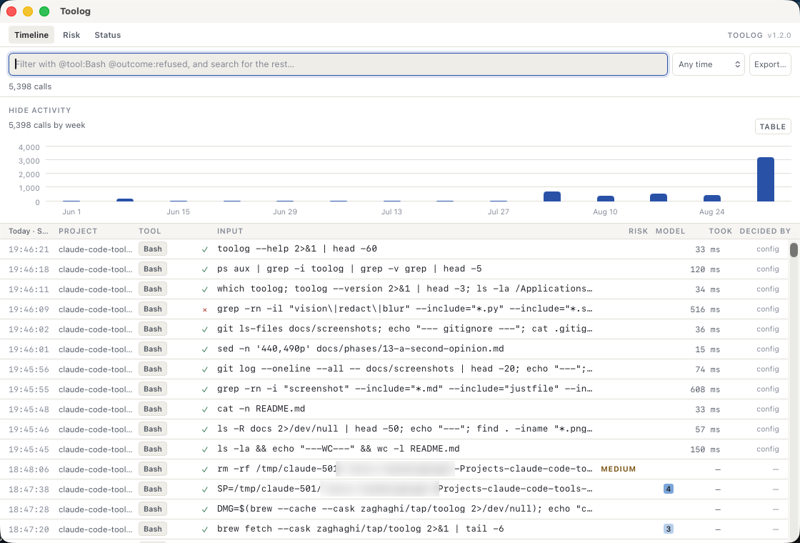
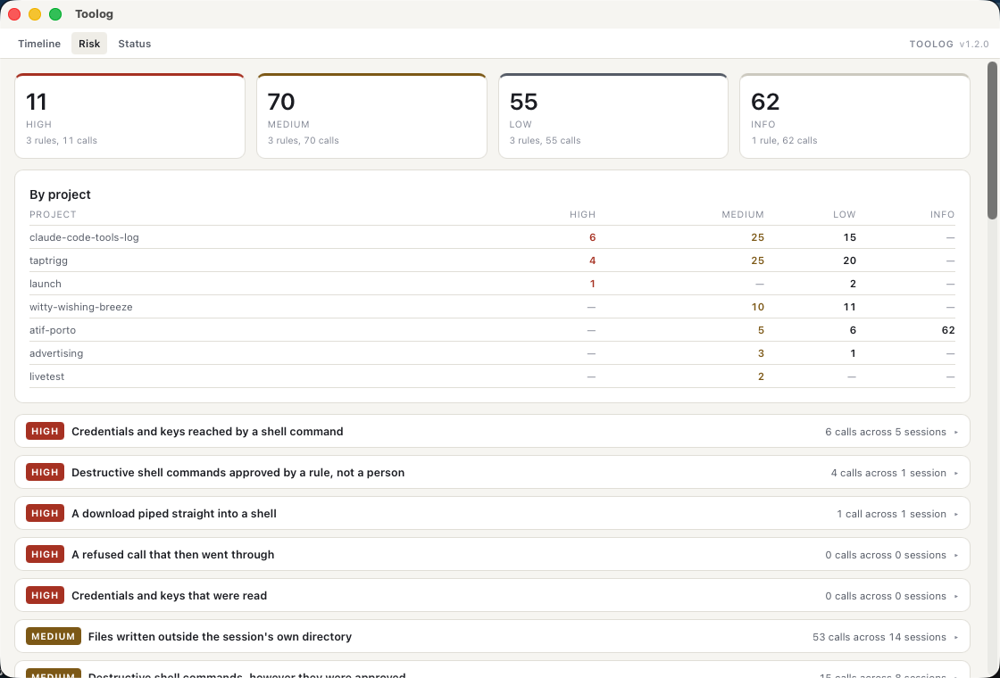
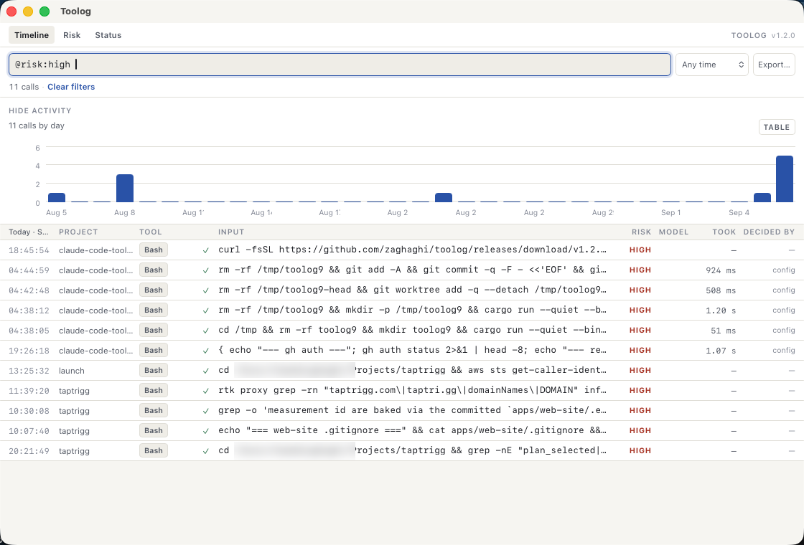
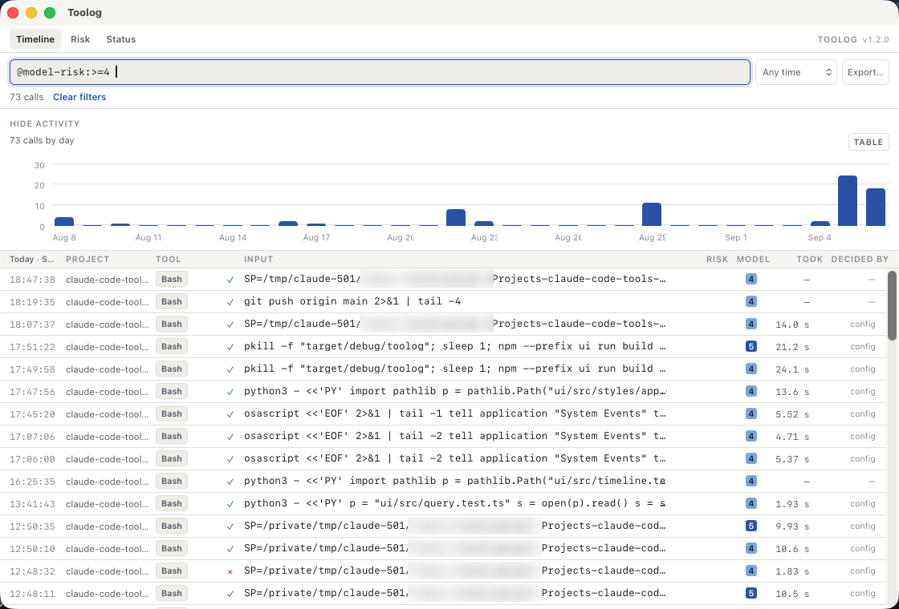

# Toolog

**A local audit trail for Claude Code tool calls.** macOS, one signed app, nothing leaves the
machine.

Claude Code runs tools on your machine — shell commands, file edits, network fetches. Today there is
no way to answer *"what did the agent actually do, when, in which repo, and who approved it?"*
without scrolling a terminal that has already gone.

Toolog captures every tool call, stores it in an embedded database on your machine, and gives you
three views over it: a forensic timeline, a permission and risk review, and the state of capture
itself.

| | |
|---|---|
| [](docs/screenshots/timeline.png) | [](docs/screenshots/risk.png) |
| **The timeline.** Every tool call, newest first, under one query box — with the severity a rule gives each call and the score a local model gave the ones no rule matched. | **The risk review.** The rules evaluated, worst first, with what each one looks for whether or not it matched. |
| [](docs/screenshots/timeline-risk.png) | [](docs/screenshots/timeline-model-risk.png) |
| **`@risk:high`** — what a rule flagged, and which rule, on hover. | **`@model-risk:>=4`** — what the local model scored 4 or 5, with its one-line reading of each on hover. |

*Home directory blurred. The two columns are never the same column: a rule's severity is
deterministic, a model's score is not.*

## Nothing leaves your machine

The OTLP receiver binds `127.0.0.1` only. There is no analytics, no crash reporting, no remote
config, no account, and no update check — `brew upgrade --cask toolog` is the update path instead.

**A CI test runs a full ingest and every query the window issues, then asks the operating system
which sockets the process holds** — any address that is not loopback fails the build. A second test
proves that check can fail, by opening a socket pointed off the machine and asserting the census
sees it. The guarantee is a build failure when broken, not a promise in a readme.

**Including the model.** Toolog links llama.cpp and does not gain a downloader with it: you fetch
the `.gguf` yourself and point toolog at it. llama.cpp has a `--hf-repo` fetcher of its own that a
check reading `Cargo.toml` cannot see, so the release additionally asserts `otool -L` on the shipped
binary lists no `libcurl` and no TLS library. A config option is not a guarantee; the binary is.

See [ADR-0008](docs/adr/0008-local-only-zero-egress.md) and [PRIVACY.md](PRIVACY.md).

## How it works

Two ingestion lanes, because neither is complete alone:

```
┌──────────────┐   OTLP/HTTP POST /v1/logs      ┌────────────────────────────┐
│ Claude Code  │ ─────────────────────────────► │  toolog (single process)   │
│              │   127.0.0.1:47318              │                            │
│  writes ───► │ ~/.claude/projects/**/*.jsonl  │  OTLP receiver             │
└──────────────┘        ▲                       │  transcript tailer         │
                        │ fsevents tail         │  normalizer + joiner       │
                        └───────────────────────┼─ SQLite (WAL + FTS5)       │
                                                │  WebView UI (3 views)      │
                                                └────────────────────────────┘
```

**Transcripts** carry the untruncated content — the full shell command, the full file diff. OTEL
truncates tool inputs at 512 characters, which is not evidence. **OTEL** carries what transcripts
never record: **who approved or refused each call, and under which rule**, and how long it took.

The two are joined exactly on `tool_use_id`, and where they disagree, that is a finding rather than
an inconsistency to paper over: a call only the transcript saw is a gap in collection, and a call
only OTEL saw had no transcript body written. This is how the tool demonstrates its own completeness
instead of asserting it. Neither lane puts any code on Claude Code's critical path — one is a
read-only file watch, the other a fire-and-forget export whose failure costs nothing.
See [ADR-0002](docs/adr/0002-dual-ingestion-transcripts-and-otel.md).

**A second opinion, optional and advisory.** Twelve rules find what someone thought to write a rule
for, and 77% of the owner's store was Bash commands no rule had ever matched — reported as nothing,
which reads as *these are fine* and means *these were not examined*. Point toolog at a local `.gguf`
and it reads them and says what each was doing. It is never a rule, never a severity, and never a
number in the summary — it gets its own column, its own section, and its own block in the detail
pane. See [ADR-0013](docs/adr/0013-a-verdict-is-stored-not-recomputed.md), and
[docs/](docs/README.md#phases) for the one command that fetches the model.

## Install

```
brew install --cask zaghaghi/tap/toolog
```

Or download the `.dmg` from [Releases](https://github.com/zaghaghi/toolog/releases). It is a
universal build signed with a Developer ID and notarized by Apple, so it opens without a
Gatekeeper warning. Verify what you got:

```
shasum -a 256 -c SHA256SUMS
spctl --assess --type execute --verbose=2 /Applications/toolog.app
```

Then, from a terminal — the same binary is both the app and the CLI:

```
toolog doctor --fix          # configures Claude Code telemetry, merged, with a backup
toolog backfill              # imports your existing history
toolog                       # starts the menu-bar app and the receiver
```

### Uninstall

```
toolog uninstall             # show what would change
toolog uninstall --apply     # do it
```

It removes the login agent and puts `~/.claude/settings.json` **back byte for byte** from the
backup taken before toolog first wrote to it — or, if you have edited that file since, removes
only toolog's own six keys and says why it did not restore. Your recorded history is kept unless
you add `--delete-data`. `brew uninstall --cask toolog` runs the same thing; add `--zap` to
delete the history too. There is also a "Remove toolog" section on the Status page.

### From a checkout

```
npm --prefix ui ci           # the window's dependencies, once
just release                 # bundles the window, then builds one binary: the app and the CLI
just bundle                  # the distributable universal .app and .dmg
```

The window is TypeScript compiled by Vite and **embedded in the binary**, so it is built first;
`just build`, `just release`, `just run` and `just bundle` all do that for you.

## Commands

| | |
|---|---|
| `toolog` | Menu-bar app: receiver, transcript tailer, window on demand |
| `toolog doctor [--fix]` | The state of the integration. Read-only unless `--fix` |
| `toolog backfill` | Import `~/.claude/projects`. Safe to re-run |
| `toolog verify` | Cross-check the two lanes: gaps, refusals, completeness |
| `toolog verify --chain` | Walk the integrity chain over stored evidence, and print its head |
| `toolog purge` | Show what retention would remove. `--apply` to remove it |
| `toolog risk` | Evaluate the risk rules: what got approved, and how |
| `toolog model set PATH` | Point the local second opinion at a `.gguf`. Never downloads |
| `toolog model status` | The configured model, and how far the examination has got |
| `toolog export` | JSON, JSONL, CSV or Markdown, with filters |
| `toolog agent install` | A login agent so capture survives a restart |
| `toolog uninstall` | Undo the install. Restores `settings.json`; keeps your history |

`doctor --fix` writes only to `~/.claude/settings.json`, merges rather than overwrites, keeps a
timestamped backup, and refuses outright if a non-loopback OTEL endpoint is already configured —
your existing telemetry pipeline is not ours to redirect. See
[ADR-0006](docs/adr/0006-configure-via-settings-env-block.md).

## Limitations, stated rather than discovered

- **macOS 11 or later, and macOS only.** Nothing assumes it except the LaunchAgent, so the port is
  open — it would need a systemd user unit for both the install and the uninstall path.
- **Decisions and latency exist only for sessions captured live.** They arrive on the OTEL lane,
  which is not replayable: a session that ran while toolog was not listening has its commands and
  results, from the transcript, and no decision layer ever. `toolog verify` reports exactly which
  sessions those are, rather than averaging across a gap as if it were not there.
- **Cost is captured and never shown.** `api_request` records are stored and counted, and nothing
  reports spend or tokens. A scope decision, not an omission —
  [ADR-0010](docs/adr/0010-no-cost-reporting.md).
- **Quitting from the menu bar stops capture**, and it is meant to. Anything Claude Code runs while
  toolog is quit is recoverable by a later `toolog backfill`, minus the decision layer above.
- **No update notification.** If you downloaded the `.dmg` directly, nothing will tell you a new
  version exists. That is the cost of an application that makes no network calls.
- **A project directory name cannot always be decoded back to a path.** Claude Code encodes `/` as
  `-`, so `/a/b/my-app` and `/a/b/my/app` name the same directory. Project attribution therefore
  comes from `cwd` in the records; only per-project *exclusion* matches on the encoded name.
- **The second opinion is a 3.1 GB dependency against a 166 MB store, and it is wrong sometimes.**
  It is a 4.6B quantized model: measured on the owner's store it scores a benign `cargo test` at 2
  and needed its rubric spelled out before it called a raw-device `dd` dangerous. That is why it is
  opt-in, advisory, and kept visibly apart from the rules everywhere it appears — and why its
  one-line intent summary may be the half worth keeping even where the score is not.
- **Anyone who can read your disk can read the database.** It is a plain SQLite file, on purpose —
  that is what lets you check the claims in `PRIVACY.md` without trusting this program. Encryption
  at rest was evaluated and declined in favour of FileVault.

## Documentation

- [docs/README.md](docs/README.md) — the thirteen phases, and the facts the design rests on
- [docs/adr/](docs/adr/README.md) — thirteen architecture decision records
- [PRIVACY.md](PRIVACY.md) — what is captured, what is not, and what never leaves
- [docs/database.md](docs/database.md) — the SQLite file, and what is in it
- [docs/releasing.md](docs/releasing.md) — how a signed, notarized release is cut
